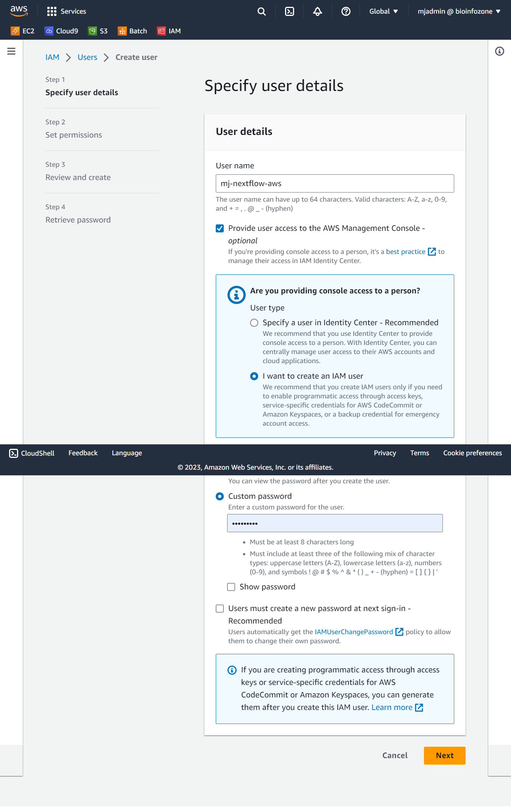
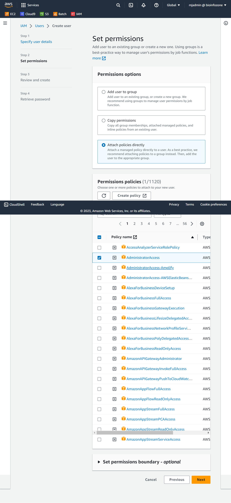
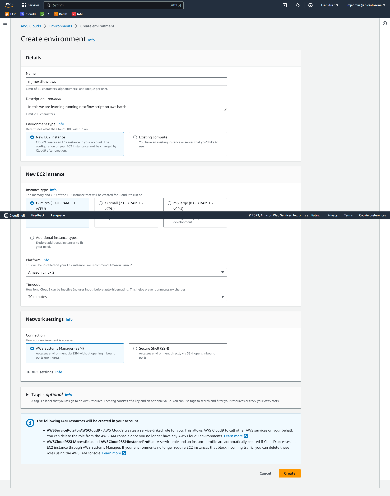
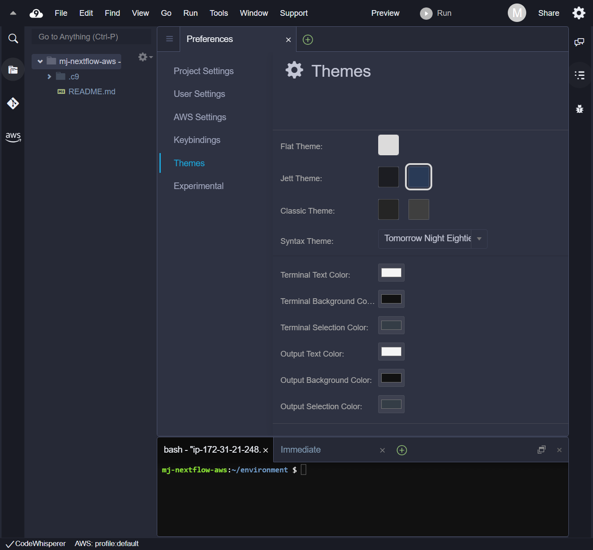
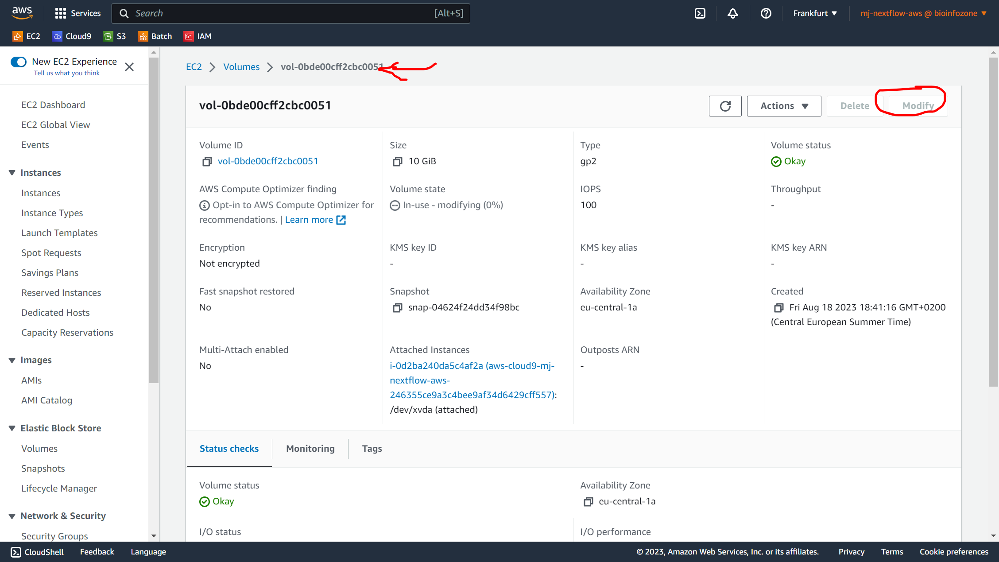
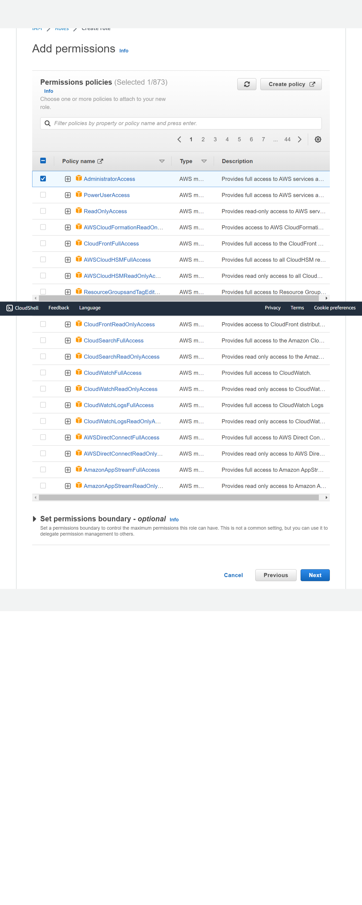
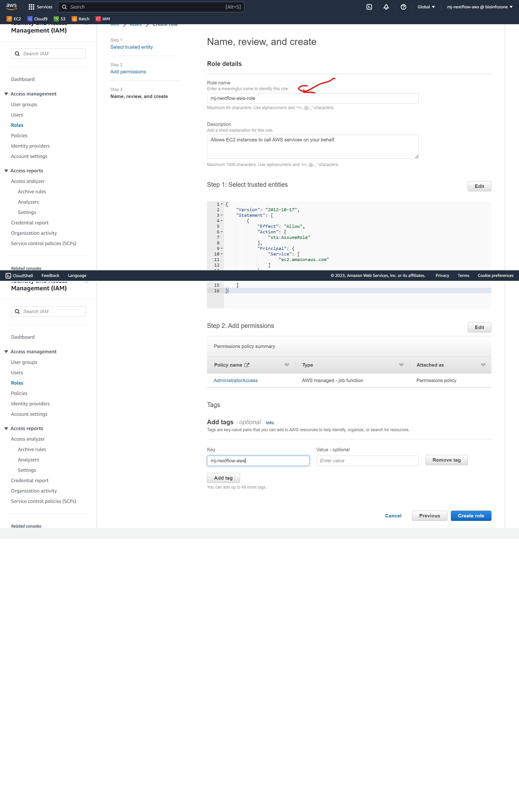
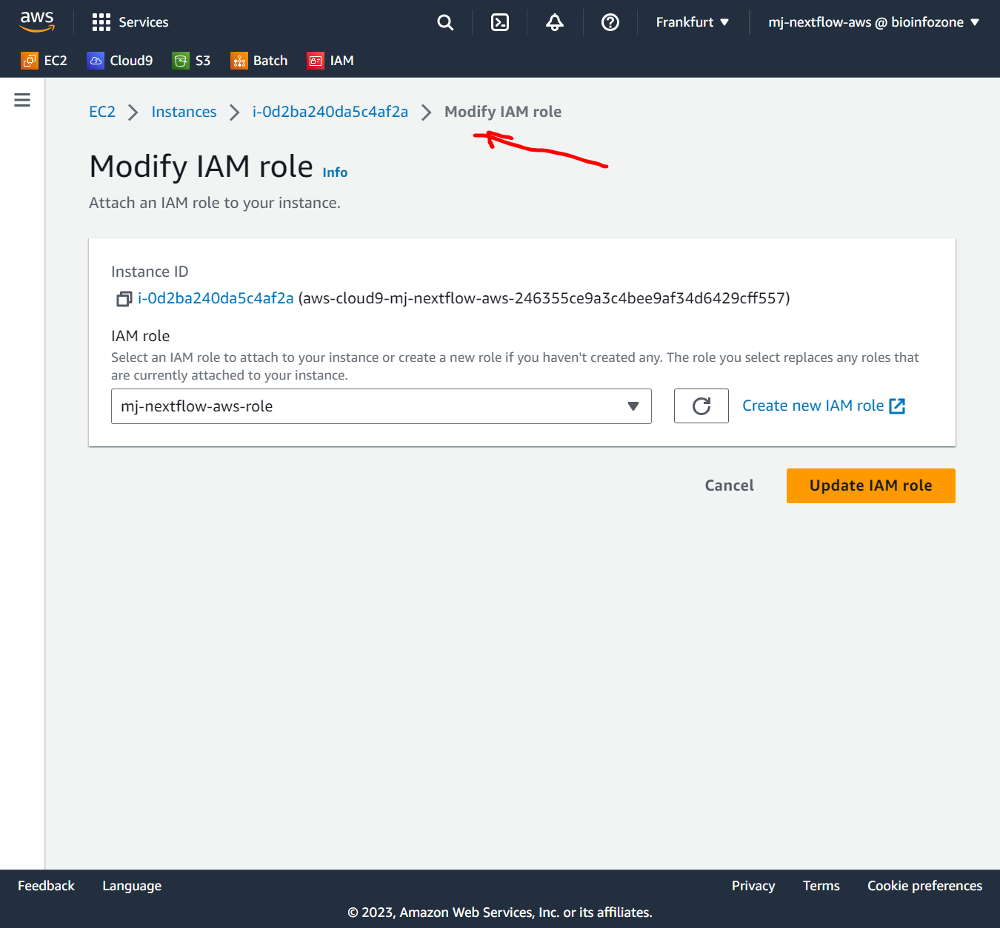

## AWS - cloud9 setup

In this we are going to learn how we can set-up AWS components to run nextflow :

AWS setup:

**Step-1 : IAM-User**

If we are running nextflow on ourself we can first create IAM user with administator access or with aws access (programatic)

- Go to the IAM > Users > Create user  like below and setup username and custom paswword (if we are using ourself )
- For other people we have to setup programatic access
- click next once completed following fields.



- Set permissions or attach policies to IAM user . Here i have selected Administaroraccess policy




- click next and finish USer creation . rememberthe access key and secret key / save it some place. Don't share this or publish on repository. 

**Step-2 : login from New USER**

- logout from current session and relogin with created user details

**Step-2 : cloud9 setup**

After login with new user . we can setup cloud9 . cloud9 is an IDE where we can link EC instance, storage S3 and run Nextflow scripts or any scripts.


- create cloud9 environment and fill following details



I have selected here basic instance settings (low cost). you can select instances according to your needs.

**step3 : cloud9 theme set** 

we can set cloud9 IDE theme according to our choice like below
- select top right GEAR icon and set theme.



**step4 : EC2 - cloud9 EBS volume resize**

we can resize cloud9 volume (10 GB default) to some other 
- Go to aws > EC2 > instance > our named cloud9 instance click that 
- then click storage
- then volume
- then modify
- change volume size 10GB to 30G



- to make sure changes takes effectively 
- run following command on cloud9 terminal window

```
sudo growpart /dev/xvda 1
sudo xfs_growfs $(df -h |awk '/^\/dev/{print $1}')

df --human-readable


```


**step5: Create IAM role**

Roles are necessary to give access to Aws services like storage, batch, EC2..etc

so for our user we can assign roles as like below

- As like below create AWS role and give permission and role name

  
  
 

 **step6: Attach IAM role to EC2**

 We have to attach this IAM role to our cloud9 EC2 instance created above (step4)

 - Go to EC2 instance , select it, click Action , security, modify IAM role, select our created IAM role (step5)

 > EC2 > Action > security > modify IAM > ...

   


 **step7: Disable Cloud9 modifiying cap**

 sometimes cloud9 modify IAM role so we need to turoff that

 - Go to cloud9 
 - top right GEar icon
 - AWS setting
 - turnoff AWS managed credential

 **cross check IAM**

 Before procedding to work on nextflow , we need to check whether aws set properly and assigned proper role we created 

 - run following command to check on cloud9 terminal
 
 

 ```
 aws sts get-caller-identity


 ```

 - if it displayed proper account and IAM role in Arn


 **step8: Set AWS region and install nextflow**

 - we have to install nextflow , use Amazon coretto 

 - run following commands in cloud9 terminal
 
 ```
 sudo rpm --import https://yum.corretto.aws/corretto.key

sudo curl -L -o /etc/yum.repos.d/corretto.repo https://yum.corretto.aws/corretto.repo

sudo yum install -y java-11-amazon-corretto-devel

sudo yum install -y graphviz jq


export AWS_REGION=$(curl --silent http://169.254.169.254/latest/dynamic/instance-identity/document | jq -r .region)


echo "AWS_REGION=${AWS_REGION}" |tee -a ~/.bashrc


curl -s https://get.nextflow.io | bash
sudo mv nextflow /usr/local/bin/

 
 ```

- Install Docker 

```
sudo yum update -y
sudo amazon-linux-extras install docker
sudo yum install docker
sudo service docker start

sudo usermod -a -G docker ec2-user

```


- nextflow config add in EC2


```

cat << \EOF > $HOME/.nextflow/config
docker.enabled = true
EOF


```

- check whether nextflow installed by typing below command . 

```
nextflow -version

      N E X T F L O W
      version 23.04.3 build 5875
      created 11-08-2023 18:37 UTC 
      cite doi:10.1038/nbt.3820
      http://nextflow.io

```
- if it showed version properly --

 Then we all Set !


Stop instance if we are not using (to save cost)

 --- 
 Hooray ! we setup AWS account properly now 
 ---